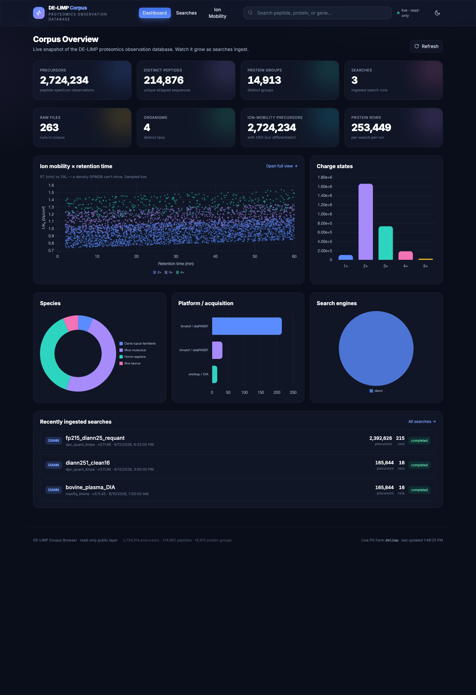

# FRAN — Fragment Reference & ANnotation

**A live, DIA-only proteomics corpus browser.** FRAN is a read-only public window onto a
growing PG Farm corpus of DIA-MS results — browse by **peptide, protein, gene, organism, or
run**, see real **MS2 spectra**, **XIC chromatograms**, **ion mobility (1/K₀)**, predicted
**fragment intensities** (Koina), and predicted **flyability** (Koina PFly).

🔗 **Live app:** https://huggingface.co/spaces/brettsp/delimp-corpus-browser
🌐 **About page:** https://bsphinney.github.io/FRAN/

GPMDB-inspired in *function*, but built for 2026 and deliberately **DIA, not DDA** — which
is what sets it apart: cross-run indexed RT (iRT), the ion-mobility dimension, and full
fragment/XIC data kept for reuse and AI training.



## Highlights
- **Live dashboard** — counts (precursors / peptides / proteins / genes / runs / organisms /
  IM-bearing precursors) that auto-refresh as ingest proceeds; species, platform, engine and
  charge distributions; an **IM × iRT** map (toggles to an iRT × peptide-count histogram);
  and a **flyability × intensity** scatter.
- **Peptide page** — modified forms (ProForma) × charge, per-run RT / 1/K₀ / m/z / q-value /
  intensity, dual-pane **XIC** (MS1 + top quant fragments), **predicted vs acquired** mirror
  spectra (Koina Prosit / AlphaPeptDeep / ms2pip), shared-transition **interference**, and
  **predicted flyability** (PFly).
- **Protein & gene pages** — observed peptides with sequence-mapped coverage, per-search/run
  stats, plain-language summaries, STRING links.
- **Ion-mobility showcase**, **search/run browser**, and a word-hunt for English words hidden
  in peptide sequences.

## Architecture
- **Backend:** FastAPI + psycopg2 against PG Farm, with a **read-only** connection pool and a
  **table allowlist** so the public layer structurally cannot reach the internal/customer
  tables (`app/db.py`).
- **Frontend:** single-page app — Tailwind + Chart.js, no build step (`app/static/app.js`,
  `app/templates/index.html`).
- **External models:** Koina (Wilhelm lab) for fragment-intensity and flyability prediction
  (`app/koina.py`).
- **Packaging:** Docker; deployed as a Hugging Face Docker Space (port 7860).

## Security & governance (`app/db.py`)
1. **Read-only sessions** (`default_transaction_read_only=on`); only `SELECT`/`WITH` allowed.
2. **Public-layer allowlist** — every query declares its tables, validated against
   `PUBLIC_TABLES`; internal/customer tables are absent and unreachable.
3. **Parameterized queries only** — no raw or string-interpolated user SQL.
4. **Credentials via env / Space secrets** — never committed. See `README_HF.md` for the
   public-hosting credential decision (use a dedicated read-only role or a snapshot DB).

## Installation

**Prerequisites:** Python 3.11+ (or Docker) and a PG Farm credential for the `delimp`
corpus — a 7-day PG Farm token, or a dedicated read-only role (see *Security & governance*).
Without a credential the app still starts and serves the UI, but shows a "database
unavailable" state — there is no local database to create.

### Option A — local (Python)
```bash
git clone https://github.com/bsphinney/FRAN.git && cd FRAN
python3 -m venv .venv && . .venv/bin/activate
pip install -r requirements.txt

# provide the DB credential — pick ONE:
export DELIMP_PG_TOKEN_FILE=/path/to/.pgfarm_token   # token in a file (recommended for dev)
# export DELIMP_PG_PASSWORD=<pg-farm-token>          # or pass the token directly

uvicorn app.main:app --reload --port 7860
# open http://localhost:7860   •   health: curl -s localhost:7860/health
```

### Option B — Docker
```bash
docker build -t fran .
docker run --rm -p 7860:7860 -e DELIMP_PG_PASSWORD="$(cat /path/to/.pgfarm_token)" fran
# open http://localhost:7860
```

### Option C — with an AI agent
Point your coding agent (Claude Code, Cursor, etc.) at **[`AGENTS.md`](AGENTS.md)** — a
self-contained runbook that installs dependencies, wires the credential, launches the app,
and verifies `/health`. Hand the agent your PG Farm token and let it drive.

### Configuration (environment variables)
| Var | Default | Notes |
|-----|---------|-------|
| `DELIMP_PG_HOST` | `pgfarm.library.ucdavis.edu` | |
| `DELIMP_PG_PORT` | `5432` | |
| `DELIMP_PG_DB` | `uc-davis-genome-center-proteomics-core/delimp` | |
| `DELIMP_PG_USER` | `genome-proteomics-service-account` | |
| `DELIMP_PG_SSLMODE` | `require` | not `verify-full` |
| `DELIMP_PG_PASSWORD` / `DELIMP_PG_SECRET` | — | PG Farm token (set as an **HF Secret** when deployed) |
| `DELIMP_PG_TOKEN_FILE` / `DELIMP_PG_SECRET_FILE` | — | alternative: path to a token file |
| `DELIMP_PG_MAXCONN` | `6` | read-only connection-pool size |
| `DELIMP_CACHE_TTL` | `20` | seconds to cache dashboard aggregates |

Copy **`.env.example`** as a starting template. Hugging Face Space deployment notes are in
**`README_HF.md`** and **`DEPLOY_HF.md`**.

### Verify
`curl -s localhost:7860/health` should report `connected: true` and `read_only: "on"`.

## What FRAN is part of
FRAN is the public corpus browser for **[DE-LIMP](https://github.com/bsphinney/DE-LIMP)**, a
Shiny proteomics pipeline for DIA-NN data. Searches analyzed in DE-LIMP are ingested into the
shared corpus that FRAN serves.

## License
MIT
